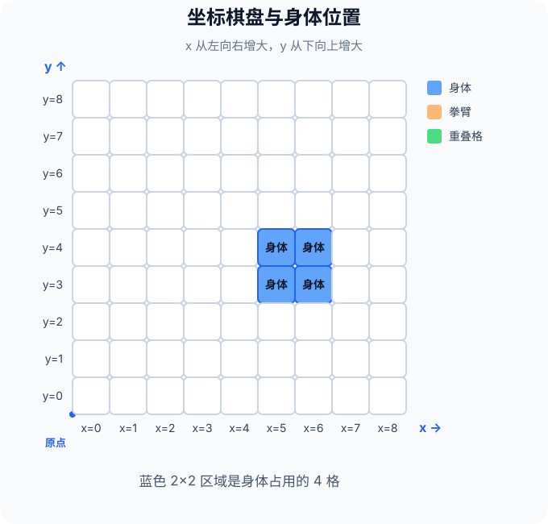
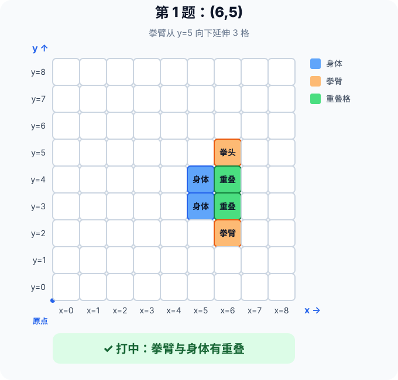
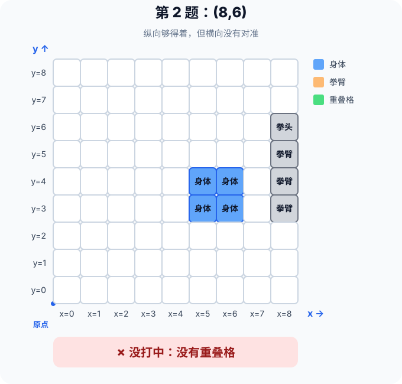
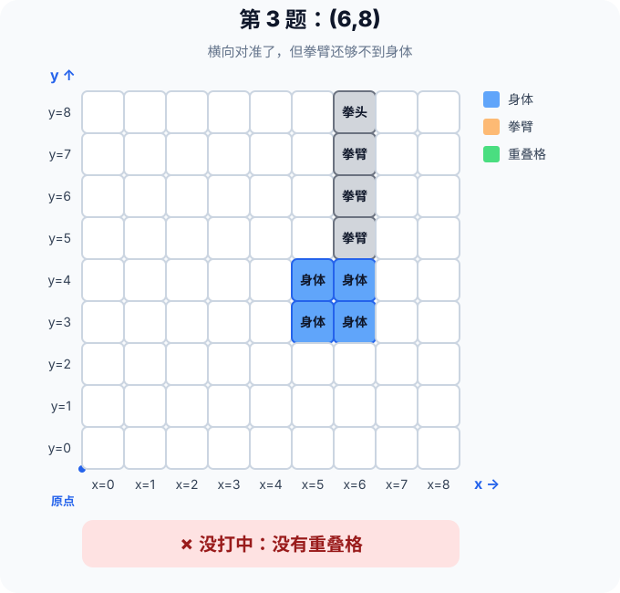
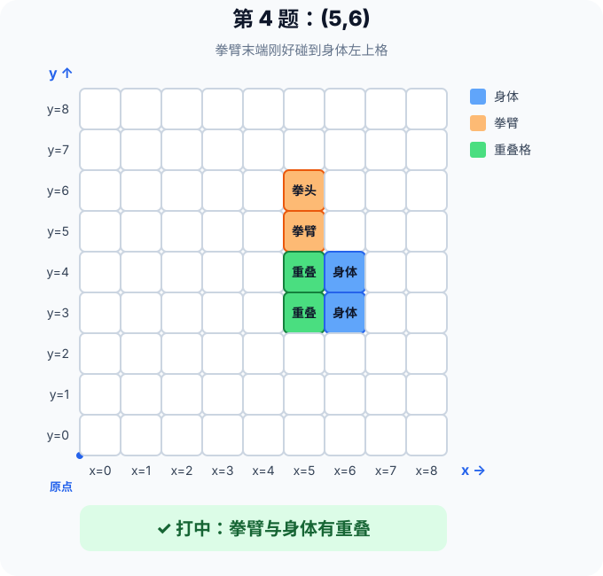
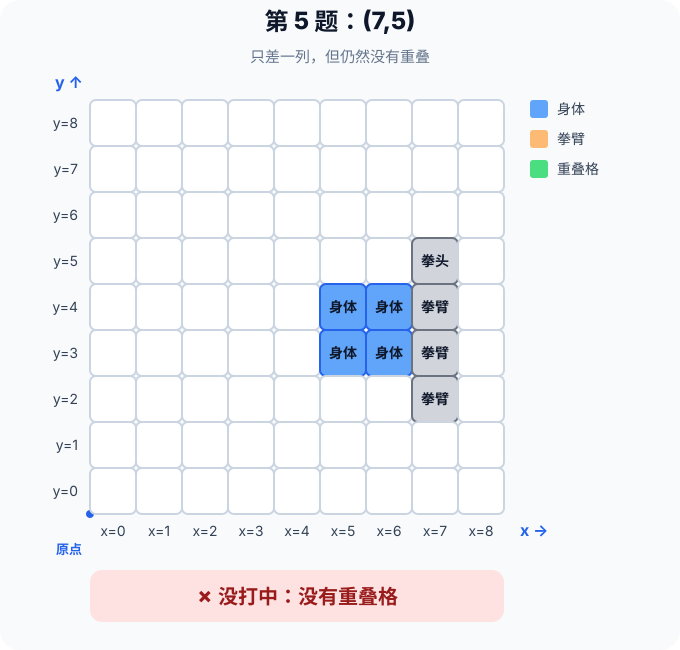

# 少儿编程课：拳击游戏里的坐标与碰撞检测

> 适合 8～12 岁小朋友和家长一起阅读
>
> 配合游戏：《方块世界》里的「拳击原型 V1」
>
> 游戏地址：https://soapgu.github.io/block-world/prototype/boxer/v1/

## 开场：先玩两局

屏幕上有两个方块机器人。它们可以在擂台里移动，也可以伸出左拳或右拳：

- 按 **A** 出左拳，按 **D** 出右拳；
- 按方向键移动；
- 每次打中，对手少 1 格生命；
- 谁的 5 格生命先用完，谁就被 KO。

玩的时候请观察：离得远时为什么会打空？靠近以后，计算机又怎么知道这一拳打中了？

## 第一章：计算机怎样“看见”拳头

计算机不会像人一样看画面。它判断命中主要依靠两样东西：

1. **坐标**：记录每个方格的位置；
2. **碰撞检测**：检查拳臂占用的格子是否和身体占用的格子重叠。

换句话说，画面里的“机器人、身体和拳头”，在计算机眼里都是一组数字。

## 第二章：给每个格子一个门牌号

一张方格棋盘上，每个格子都有一个坐标 **(x, y)**：

- 左下角格子是原点 **(0, 0)**；
- **x** 表示第几列，从左向右增大；
- **y** 表示第几排，从下向上增大。

图中的身体占 2×2 共 4 格：

| 位置 | 坐标 |
|---|---|
| 左下格 | (5, 3) |
| 右下格 | (6, 3) |
| 左上格 | (5, 4) |
| 右上格 | (6, 4) |

因此可以说：身体的横向范围是 **x=5～6**，纵向范围是 **y=3～4**。

## 第三章：拳头不是一个孤零零的点

准备出拳时，拳头有一个起点；真正出拳时，手臂会沿着一个方向伸出去，占用一串连续的格子。

在这组题里，AI 站在身体上方，拳臂从起点继续向下伸出 3 格。连同起点在内，出拳区域一共占 4 格。例如拳头起点在 **(6, 5)** 时，拳臂会经过：

**(6, 5) → (6, 4) → (6, 3) → (6, 2)**

只要其中任意一格与身体的 4 个格子重叠，就算打中。这正是游戏代码实际采用的思路：检查“拳臂区域”和“身体区域”有没有重叠。

绿色格同时属于拳臂和身体，所以这一拳命中。

## 第四章：命中需要“对准 + 够得着”

在本课固定场景中，判断一拳能否命中可以分两步：

1. **横向对准**：拳头的 x 必须是 5 或 6；
2. **纵向够得到**：拳头起点的 y 必须是 5 或 6。

合起来就是：

> **5 ≤ 拳头 x ≤ 6，而且 5 ≤ 拳头 y ≤ 6**

“而且”很重要：两个条件必须同时成立。

这个公式只适用于本课设定的身体位置和“从起点继续伸出 3 格”的出拳距离。如果机器人移动了、身体大小变了或拳臂长度变了，数字也要跟着改变。更通用的做法仍然是检查两个区域有没有重叠。

### 横向没有对准

拳头在 **(8, 6)** 时，纵向距离足够，但 x=8 不在身体的 x=5～6 之内。

拳臂从身体旁边经过，没有重叠格，所以打空。

### 纵向距离太远

拳头在 **(6, 8)** 时，x 已经对准，但拳臂只能经过 y=8、7、6、5，仍然够不到 y=4 的身体。

口诀是：**先看有没有对准，再看够不够得到。**

## 第五章：开始练习

请打开《编程课-拳击练习题》。每道题都按下面三步完成：

1. 在图上标出拳头起点 P；
2. 检查 x 是否对准、y 是否够得到；
3. 判断拳臂和身体是否会出现重叠格。

做完以后，再回到下一章核对答案。

## 第六章：五道题答案解析

### 第 1 题：(6, 5)

- x=6，在 5～6 之内：对准了；
- y=5，在 5～6 之内：够得到；
- 拳臂与身体出现重叠格。

**答案：打中。**

### 第 2 题：(8, 6)

- x=8，不在 5～6 之内：没有对准；
- y=6 虽然够得到，但只满足一个条件。

**答案：没打中。**

### 第 3 题：(6, 8)

- x=6：对准了；
- y=8：距离太远；
- 拳臂最远仍没有碰到身体。

**答案：没打中。**

### 第 4 题：(5, 6)

- x=5：对准身体左边一列；
- y=6：拳臂末端刚好到达 y=4；
- 末端与身体左上格重叠。

**答案：打中。**

### 第 5 题：(7, 5)

- y=5：距离足够；
- x=7：比身体右边界多一列；
- 即使只差一格，也没有重叠。

**答案：没打中。**

### 答案小结

| 题号 | 拳头起点 | x 对准？ | y 够得到？ | 结果 |
|---|---|---|---|---|
| 1 | (6, 5) | 是 | 是 | 打中 |
| 2 | (8, 6) | 否 | 是 | 没打中 |
| 3 | (6, 8) | 是 | 否 | 没打中 |
| 4 | (5, 6) | 是 | 是 | 打中 |
| 5 | (7, 5) | 否 | 是 | 没打中 |

## 结束语：你学会了什么

- 坐标是方格的“门牌号”；
- 身体和拳臂都可以表示成一组坐标；
- 两组格子出现重叠，就发生了碰撞；
- 在固定场景中，可以用范围比较快速判断结果；
- “对准 + 够得着”两个条件缺一不可。

赛车撞墙、小鸟碰到水管、角色踩到敌人，都可以用类似的碰撞检测来判断。下次玩游戏时，你也可以猜一猜：屏幕背后有哪些区域正在互相比较？
