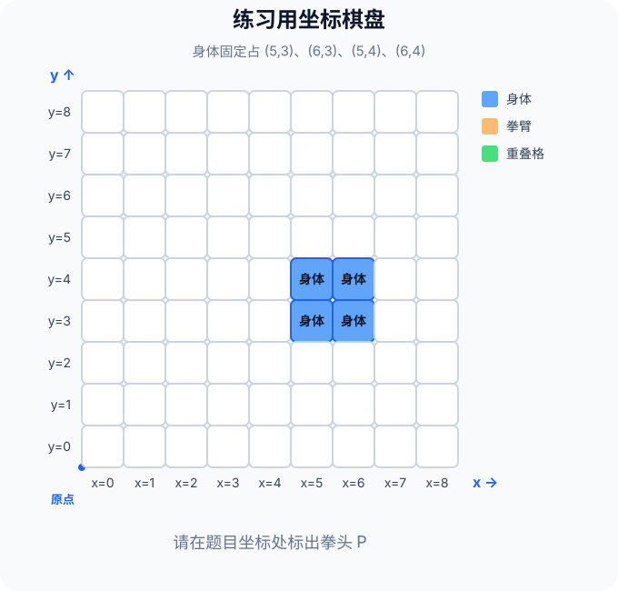

# 少儿编程课：拳击碰撞检测练习题

> 请先读完《编程课-拳击原理》再做题。
>
> 本页不提供答案；完成后到原理文档的第六章核对。

## 做题前的小抄

我方身体固定占 4 格：

| 位置 | 坐标 |
|---|---|
| 左下格 | (5, 3) |
| 右下格 | (6, 3) |
| 左上格 | (5, 4) |
| 右上格 | (6, 4) |

AI 在身体上方出拳，拳臂从拳头起点继续向下伸出 3 格；连同起点在内，出拳区域共占 4 格。

> **判断口诀：x 对准身体，y 够得到身体；两个条件都满足才会打中。**

本课固定场景的快捷判断是：

> **5 ≤ 拳头 x ≤ 6，而且 5 ≤ 拳头 y ≤ 6**

每道题都完成三步：

1. 在图中标出拳头起点 **P**；
2. 判断 x 是否对准、y 是否够得到；
3. 写出最终结论。

## 第 1 题：拳头起点在 (6, 5)

- x 判断：`5 ≤ 6 ≤ 6`，________（成立 / 不成立）
- y 判断：`5 ≤ 5 ≤ 6`，________（成立 / 不成立）
- 拳臂和身体会有重叠格吗？________________
- 最终结论：________________

## 第 2 题：拳头起点在 (8, 6)

- x 判断：`5 ≤ 8 ≤ 6`，________（成立 / 不成立）
- y 判断：`5 ≤ 6 ≤ 6`，________（成立 / 不成立）
- 拳臂和身体会有重叠格吗？________________
- 最终结论：________________

## 第 3 题：拳头起点在 (6, 8)

- x 判断：`5 ≤ 6 ≤ 6`，________（成立 / 不成立）
- y 判断：`5 ≤ 8 ≤ 6`，________（成立 / 不成立）
- 拳臂和身体会有重叠格吗？________________
- 最终结论：________________

## 第 4 题：拳头起点在 (5, 6)

- x 判断：`5 ≤ 5 ≤ 6`，________（成立 / 不成立）
- y 判断：`5 ≤ 6 ≤ 6`，________（成立 / 不成立）
- 拳臂和身体会有重叠格吗？________________
- 最终结论：________________

## 第 5 题：拳头起点在 (7, 5)

- x 判断：`5 ≤ 7 ≤ 6`，________（成立 / 不成立）
- y 判断：`5 ≤ 5 ≤ 6`，________（成立 / 不成立）
- 拳臂和身体会有重叠格吗？________________
- 最终结论：________________

## 做完后的自查

- [ ] 我把每个拳头起点都标在了正确的坐标格里。
- [ ] 我分别检查了 x 和 y，没有只看一个方向。
- [ ] 我能用“有没有重叠格”解释自己的答案。
- [ ] 我已经到原理文档第六章核对答案。

想一想：如果拳臂只能向下延伸 2 格，哪些题目的答案会改变？
